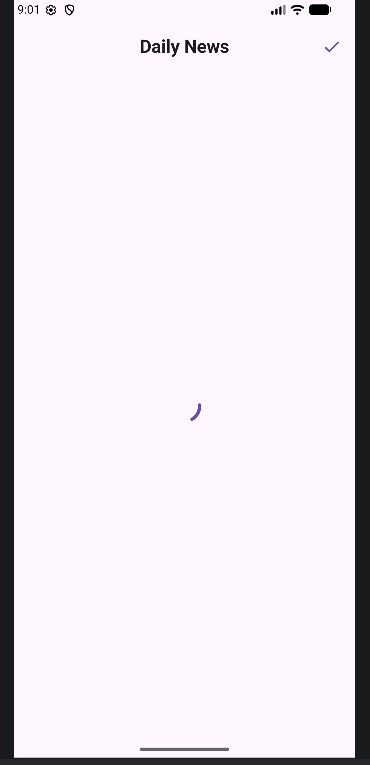
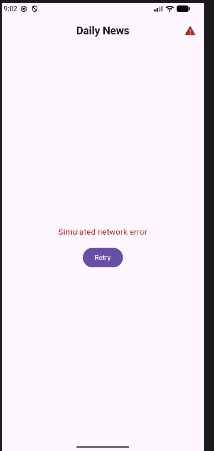

# NewsReaderApp

**Nama:** Muharyan Syaifullah  
**NIM:** 123140045  
**Mata Kuliah:** Pemrograman Aplikasi Mobile  

## Deskripsi
NewsReaderApp adalah aplikasi Android modern yang dibangun menggunakan **Jetpack Compose** untuk memenuhi **Tugas Praktikum Minggu 6**. Aplikasi ini mendemonstrasikan integrasi REST API dengan arsitektur yang bersih menggunakan Repository Pattern.

Aplikasi ini mengambil data berita terkini dan menampilkannya dalam antarmuka yang responsif, lengkap dengan penanganan status UI yang komprehensif.

## Fitur Utama
- **Fetch Berita Real-time**: Mengambil data dari public API (NewsAPI).
- **Daftar Artikel**: Menampilkan gambar, judul, deskripsi, dan penulis berita.
- **Detail Artikel**: Tampilan mendalam untuk membaca konten artikel secara utuh.
- **Pull to Refresh**: Fitur tarik layar untuk memperbarui berita dengan komponen Material 3 terbaru.
- **Manajemen State UI**: Penanganan kondisi **Loading**, **Success**, dan **Error** yang informatif.
- **Arsitektur Repository**: Pemisahan logika data dan UI untuk kode yang lebih modular dan mudah diuji.

## API yang Digunakan
Aplikasi ini menggunakan [NewsAPI](https://newsapi.org/) untuk sumber data.
- **Endpoint**: `v2/everything`
- **Query**: `technology`
- **Library**: Retrofit dengan Gson Converter.

## Teknologi yang Digunakan
- **Bahasa**: Kotlin
- **UI Framework**: Jetpack Compose (Material 3)
- **Networking**: Retrofit & OkHttp
- **Image Loading**: Coil Compose
- **Concurrency**: Kotlin Coroutines & Flow
- **Architecture**: ViewModel & Repository Pattern

## Struktur Project
```text
com.example.newsreaderapp
├─ data
│  ├─ model        # Data classes (Article, NewsResponse)
│  ├─ network      # Retrofit configuration & API Service
│  └─ repository   # Data source abstraction
├─ ui
│  ├─ component    # Reusable UI elements (ArticleItem)
│  ├─ screen       # Main screens (List, Detail)
│  └─ state        # UI State holders (NewsUiState)
├─ viewmodel       # Business logic handling
└─ MainActivity.kt # Entry point & Navigation
```

## Screenshot

| Loading State | Success State | Error State |
| :---: | :---: | :---: |
|  |  |  |

| Detail Screen | Refresh State |
| :---: | :---: |
|  |  |

---

## Cara Menjalankan Project
1. Clone repository ini.
2. Buka di **Android Studio Ladybug** atau versi terbaru.
3. Pastikan koneksi internet aktif.
4. Jalankan pada Emulator atau Perangkat Fisik.
5. *Catatan: Gunakan ikon toggle di Top Bar untuk mensimulasikan kondisi Error/Loading saat pengambilan gambar/video.*

## Tujuan Pembelajaran
Project ini mencakup implementasi praktis dari:
- Koneksi REST API di Android.
- State management di Jetpack Compose.
- Implementasi Design System Material 3.
- Penerapan Clean Architecture sederhana.
